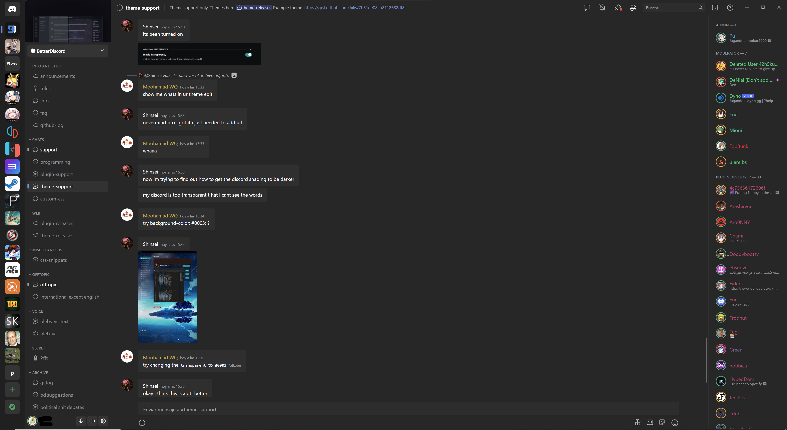

# Fluent (Beta)

Brings the look of Windows 11 to Discord.

1 In the screenshots I also use [this](https://betterdiscord.app/theme/RadialStatus) theme
2 The screenshots are taken in a 4k screen with 150% scaling

## Download

BetterDiscord: [Download](https://github.com/xsm2/Fluent/releases/latest)

Powercord Install: `git clone https://github.com/xsm2/Fluent`

## Contributing

Looking to contribute to Fluent theme? Read the the [contributing.md](https://github.com/xms2/Fluent/blob/main/CONTRIBUTING.md) file.

## License

See the [LICENSE](https://github.com/xsm2/Fluent/blob/main/LICENSE.md) file for license rights and limitations (MIT).

## PD
This is a little fork by me, xsm2, to fix and modify a few things, all the credit should go to [Gibbu](https://github.com/Gibbu)/[DiscordStyles](https://github.com/DiscordStyles). If you want to see the changes just look at the commits, but the most important ones are:

- Less padding/margins in general
- Disabled seflmessages addon(so no more messages on the right)
- Moved Minimize, Maximize and Close buttons to the Toolbar (Thanks to [doggybootsy](https://github.com/doggybootsy/FluentCord) for the ""inspiration""(aka the code))