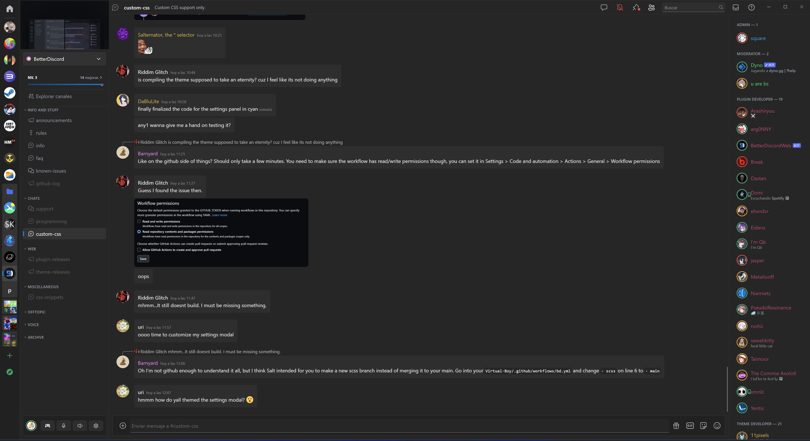

# Fluent

Brings the look of Windows 11 to Discord.

1 In the screenshots I also use [this](https://betterdiscord.app/theme/RadialStatus) theme 
2 The screenshots are taken in a 4k screen with 150% scaling 
3 The screenshots are not frecuently updated, the theme will probably be more similar to the ones found in [Fluent](https://github.com/DiscordStyles/Fluent) 

## Download

BetterDiscord: [Download](https://github.com/xsm2/Fluent/releases/latest)

## Contributing

Looking to contribute to Fluent theme? Read the the [contributing.md](https://github.com/xms2/Fluent/blob/main/CONTRIBUTING.md) file.

## License

See the [LICENSE](https://github.com/xsm2/Fluent/blob/main/LICENSE.md) file for license rights and limitations (MIT).

## PD
This is a little fork by me, xsm2, to fix and modify a few things for my personal use, all the credit should go to [Gibbu](https://github.com/Gibbu)/[DiscordStyles](https://github.com/DiscordStyles). If you want to see the changes just look at the commits, but the most important ones are:

- A few style modifications. Less padding/margins in general.
- Disabled seflmessages addon (no more messages on the right).
- Moved Minimize, Maximize and Close buttons to the Toolbar (Thanks to [doggybootsy](https://github.com/doggybootsy/FluentCord) for the ""inspiration""(aka the code))
- Modified to be scaled for 4k screens with 150% scaling in Windows (Some elements are bigger and there are a few scaling "bug fixes"). Not tested in other resolutions or scaling combinations.
- Themed less used parts of discord like the library
- Reverted the unified chat textbox. I really liked it, but it was too inconsistent as it only really worked well on chats and the friend page (when the list was not empty). If thinks like forums, the library, the discovery page,... getr adapted I will probably restore it.
